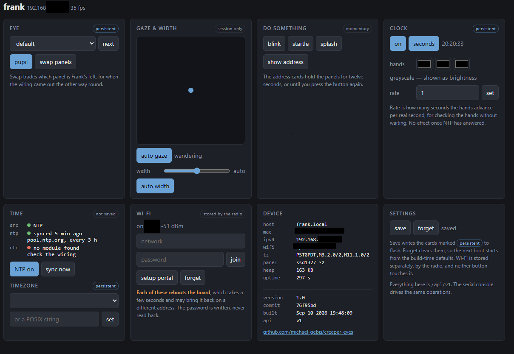

# Frankenstein Head with Animated Eyes

Twin animated eyes for the 3D printed [Frankenstein head with animated
eyes](https://www.printables.com/model/620191-frankenstein-head-with-animated-eyes),
driven by an ESP32 and two 1.5" OLED panels.

The eyes wander, blink and dilate on their own. A serial console lets you take
over — aim the gaze, set the pupil, swap the eye artwork, or fire a startle
effect — without opening the head up.

## What this fork adds

- **Runs on a generic ESP32 dev board**, not just the Adafruit Feather
- **Two panel types supported** — SSD1351 colour and SSD1327 grayscale
- **Serial command console** over the USB cable that already powers the board
- **Analogue clock face** rendered in the iris, on real time from NTP
- **WiFi** with a setup portal, reachable at `frank.local`
- **Web control page** for every eye, gaze, pupil and clock setting
- **JSON REST API** at `/api/v1`, so other programs can drive Frank too
- **Over-the-air updates**, so a sealed head never needs opening
- **Startup splash** naming each panel, so you never have to trace wires
- **BOOT button** toggles between the two eye designs
- **25 eye designs** to choose from, selected at build time
- **Display diagnostics** for bringing up new hardware
- Fixes for three rendering and initialisation bugs — see [Credits](#credits)

## What to buy

### ESP32 board

Any **classic ESP32** (ESP-WROOM-32 module, Xtensa dual core) with 4 MB flash.

> **Not** an ESP32-**S2**, **S3**, **C3** or **C6**. Those are different
> architectures and will not run this build. If your board shows up as USB
> vendor ID `303A`, it is one of those. A classic ESP32 uses a separate
> USB-serial chip — CH340 (`1A86`) or CP210x (`10C4`).

Known good: the 30-pin **DOIT ESP32 DevKit V1**, sold under a dozen names with
"NodeMCU", "ESP32S" and "Type-C" in the title. Roughly $5 each in three-packs.
Either USB-serial chip is fine; CH340 may need a driver on Windows.

### Displays — read this part carefully

Waveshare sells **two different 1.5" 128×128 OLED modules** with nearly
identical names and **identical 7-pin headers**. You cannot tell them apart by
wiring, and the wrong one shows white static.

| Product | Controller | Display | Build to use |
| :------ | :--------- | :------ | :----------- |
| **1.5inch RGB OLED Module** | SSD1351 | 65K colour | `esp32dev` |
| **1.5inch OLED Module** | SSD1327 | 16 greys | `gray` |

Buy **two**. Either works, and the grayscale panels run faster.

Which to get depends on the eyes you want. The artwork was drawn in colour,
and **some designs do not survive the conversion** — anything carrying its
detail in hue rather than in brightness comes out flat. The newt is the worst
of them: its greens and golds land on much the same grey. Others lose nothing
worth having; the default eye in particular looks every bit as good in
sixteen greys as it does in colour.

[docs/EYES.md](docs/EYES.md) renders all 25 designs both ways, side by side,
which is the quickest way to decide.

Both are 3.3 V / 5 V tolerant and need no level shifting.

### Everything else

- Breadboard and male-to-female jumper wires (14 connections)
- USB-C cable — this also carries the serial console
- The printed parts and hardware from the
  [Printables model](https://www.printables.com/model/620191-frankenstein-head-with-animated-eyes)

A plain USB port powers everything comfortably. Two panels plus an idle ESP32
draw well under 200 mA.

## Wiring

Six signals are shared by both panels; only chip select differs. Left and
right below are **Frank's own**, so facing him, his right eye is the one on
your left.

| Signal | DevKit pin | Frank's right (your left) | Frank's left (your right) |
| :----- | :--------- | :------------------------ | :------------------------ |
| VCC    | `3V3`      | VCC | VCC |
| GND    | `GND`      | GND | GND |
| DIN    | `D18`      | DIN | DIN |
| CLK    | `D5`       | CLK | CLK |
| DC     | `D33`      | DC  | DC  |
| RST    | `D27`      | RST | RST |
| CS     | `D15` / `D4` | CS ← `D15` | CS ← `D4` |

> **Use `3V3`, never `VIN`.** ESP32 GPIOs are 3.3 V and not 5 V tolerant.

Module silkscreens vary between sellers — `DIN` may be labelled `SDA`, `SI` or
`MOSI`; `CLK` may be `SCL`, `SCK` or `D0`. Match by position, not by letters.

**Full details, assembly order and troubleshooting: [docs/WIRING.md](docs/WIRING.md).**

Optional, and compiled out by default: a **battery-backed clock**, four more
wires onto two otherwise idle pins — [docs/WIRING_RTC.md](docs/WIRING_RTC.md).

## Build and flash

This is a [PlatformIO](https://platformio.org/) project. No Arduino IDE needed.

```sh
pipx install platformio          # or: pip install --user platformio
```

Everything else — the Xtensa toolchain, the ESP32 Arduino core, the Adafruit
libraries — downloads automatically on the first build.

### Environments

| Environment | Builds | Use for |
| :---------- | :----- | :------ |
| `esp32dev` | Eyes, SSD1351 colour | **Default.** Waveshare 1.5inch RGB OLED |
| `gray` | Eyes, SSD1327 grayscale | Waveshare 1.5inch OLED |
| `displaytest` | Solid-colour fills, SSD1351 | Bring-up and fault isolation |
| `probe1327` | Raw SSD1327 init, no library | Identifying an unknown panel |
| `esp32dev_rtc` / `gray_rtc_open` | Eyes plus a battery-backed clock | With a [DS3231 fitted](docs/WIRING_RTC.md) |
| `gray_rtc` | The same, with authentication on | A head left on a network. Needs credentials in `secrets.h` |
| `esp32dev_ota` / `gray_ota` | Same firmware, flashed over WiFi | Updating a sealed head |
| `rtc_probe` | Raw I²C scan and DS3231 read | Bringing up an RTC module |

`gray_rtc` is the only environment that requires anything of you before it
will build: `AUTH_USER`, `AUTH_PASS` and `AUTH_TOKEN_VALUE` in
`include/secrets.h`. It stops with an error naming them rather than producing
an open device. Use `gray_rtc_open` to skip that.

### Commands

```sh
pio run                              # build the default (colour) environment
pio run -e gray -t upload            # build and flash the grayscale build
pio run -e gray -t upload -t monitor # ...and open the console
pio device monitor                   # console only
pio device list                      # find the serial port
```

If the port is picked wrongly, pin it in `platformio.ini` with
`upload_port = COM5` (or `/dev/ttyUSB0`).

## Build options

Compile-time switches. Most live in [`src/config.h`](src/config.h); the ones
inherited from upstream are still declared in `src/main.cpp`, next to the
rendering code they belong to. Either way each is `#ifndef`-guarded, so any of
them can be overridden from `build_flags` in `platformio.ini` without editing
a source file — which is how the `gray` environment sets `USE_SSD1327`.

| Option | Default | Effect |
| :----- | :------ | :----- |
| `USE_SSD1327` | `0` | Selects the grayscale panel driver. Set by the `gray` environment via `build_flags`, not edited by hand. |
| `COMMANDS` | `1` | Serial console and BOOT-button toggle. `0` compiles both out; the REST API still works, so a network build stays fully controllable. |
| `DEBUG` | `1` | Serial diagnostics and the 1 Hz LED heartbeat. `0` saves ~2 KB. |
| `DEBUG_BAUD` | `115200` | Console speed. **Must match `monitor_speed`** in `platformio.ini`. |
| `DEBUG_LED_PIN` | `2` | On-board LED used for the heartbeat. |
| `STARTUP_SPLASH` | `1` | Panel name cards at boot. `0` boots straight into the eyes. |
| `SPLASH_SECONDS` | `5` | How long the splash counts down. |
| `BOOT_BUTTON_PIN` | `0` | Button that toggles eye artwork. |
| `SSD1327_SPI_HZ` | `8000000` | Grayscale bus speed. Lower it if long jumpers cause flicker. |
| `STARTLE_WINDUP_MS` | `1400` | Slow constrict before the startle jolt. |
| `CLOCK` | `1` | Analogue clock face. `0` compiles it out. |
| `CLOCK_*_LEN` / `CLOCK_*_HW` | — | Hand lengths and half-widths, in pixels from the iris centre. |
| `CLOCK_*_COLOR` | `0x000000` | Starting hand colours, changeable at runtime with `clock color`. |
| `CLOCK_NOON` | `128` | Where twelve sits, in the polar table's 0–511 angle. |
| `PUPIL_OFF_SCALE` | `64` | Iris scale used when the pupil is off. At or below 64 the pupil vanishes. |
| `NETWORK` | `1` | WiFi, NTP, web server and OTA. `0` compiles all of it out, saving ~669 KB. |
| `RTC` | `0` | A DS3231 battery-backed clock. `1` fits one; costs ~26 KB. See [docs/WIRING_RTC.md](docs/WIRING_RTC.md). |
| `RTC_SDA_PIN` / `RTC_SCL_PIN` | `21` / `22` | I²C pins for it. Both otherwise unused. |
| `RTC_ADDR` | `0x68` | The DS3231's fixed address. |
| `FAVICON` | `FAVICON_FRANK` | Tab icon. `FAVICON_EYES` is a generic alternative for a build that is not going into a Frankenstein. |
| `AUTH_HTTP` | `0` | Digest authentication on the page, the API and `/cmd`. |
| `AUTH_TOKEN` | `0` | A bearer token as an alternative credential, for scripts. |
| `AUTH_HOST_CHECK` | `0` | Refuse requests whose `Host` is not this device — the DNS-rebinding defence. |
| `IPV6` | `0` | All of IPv6, compiled out. Cannot usefully be turned on yet — see [IPv6](#ipv6). |
| `FIRMWARE_VERSION` | `1.0` | Bumped by hand, for features worth announcing. |
| `PROJECT_URL` | this repository | Shown by `version` and on the control page. |
| `WEB_CMD_ENDPOINT` | `1` | The `/cmd` escape hatch. `0` leaves only the REST API. Needs `COMMANDS`, since it is a passthrough to the console. |
| `WIFI_HOSTNAME` | `frank` | DHCP and mDNS name. |
| `WIFI_AP_NAME` | `frank-setup` | The setup portal's own network name. |
| `NTP_SERVER_1` / `NTP_SERVER_2` | `pool.ntp.org`, `time.nist.gov` | Time servers. A server on your own LAN works here. |
| `NET_SHOW_MS` | `12000` | How long `net` leaves the address cards up. |
| `NET_COLS` | `21` | Characters a 128 px panel fits, for wrapping those cards. |
| `TZ_MAX` | `48` | Longest POSIX timezone string that can be stored. |
| `WIFI_CONNECT_MS` | `15000` | How long to wait on a known network before opening the portal. |
| `WIFI_PORTAL_S` | `60` | How long the portal stays up before carrying on offline. |
| `WIFI_RETRY_MS` | `30000` | How often to try again after giving up at boot. |
| `TZ_DEFAULT` | US Pacific | Timezone before one is saved. |
| `STARTLE_HOLD_MS` | `1200` | How long the eyes stay wide afterwards. |

Inherited from upstream, unchanged:

| Option | Default | Effect |
| :----- | :------ | :----- |
| `TRACKING` | on | Eyelids follow the pupil. |
| `AUTOBLINK` | on | Eyes blink on their own. |
| `IRIS_MIN` / `IRIS_MAX` | `150` / `400` | Pupil range. Counter-intuitively, `IRIS_MIN` is the **widest** pupil — the value divides into the iris map. |

Pin assignments (`DISPLAY_DC`, `DISPLAY_RESET`, `SELECT_L_PIN`, `SELECT_R_PIN`,
`MOSI_PIN`, `SCLK_PIN`) are wiring, not preference — change them only if you
wire differently, and update [docs/WIRING.md](docs/WIRING.md) to match.

One switch is derived rather than set: `CONTROLLABLE` is `COMMANDS || NETWORK`,
and gates the machinery both interfaces share — the operations layer in
[`src/state.h`](src/state.h), the settings it persists, and the state the
renderer reads. Turning off *both* interfaces leaves the eyes running on their
own with nothing able to change them, which builds and works but is only
useful if you want a prop with no controls at all.

## Serial console

Open `pio device monitor` and type `help`. Commands are line-based at 115200.

| Command | Effect |
| :------ | :----- |
| `eye` | List the eye designs built into this firmware |
| `eye <name>` | Select a design by name, e.g. `eye newt` |
| `eye <index>` | Select by number, e.g. `eye 1` |
| `eye next` | Cycle to the next design |
| `look <x> <y>` | Aim the gaze; each 0–1023, `512 512` is centre |
| `look auto` | Hand gaze back to autonomous motion |
| `dilate <0-100>` | Pupil width; `100` is fully dilated |
| `dilate auto` | Hand dilation back to autonomous |
| `startle` | Constrict slowly, then snap wide with a blink |
| `pupil [on\|off]` | Pupil, or a full iris disc |
| `clock [on\|off]` | Analogue clock in the iris |
| `clock set HH:MM[:SS]` | Set the time |
| `clock rate <1-3600>` | Run the clock faster, for testing |
| `clock secs [on\|off]` | Show or hide the second hand |
| `clock color [hour\|min\|sec] RRGGBB` | Hand colours |
| `blink` | Blink both eyes now |
| `swap [on\|off]` | Swap which physical panel is which eye |
| `save` | Remember the eye design and swap across reboots |
| `forget` | Clear saved settings |
| `net [quiet]` | Address info, on the panels too |
| `net off` | Dismiss the address cards early |
| `wifi` | The network, and how to change it |
| `wifi join <ssid> [pass]` | Store a network and reboot into it |
| `wifi forget` | Clear the stored network |
| `wifi portal` | Reboot into the setup portal |
| `version` | Firmware version, commit and build date |
| `ntp [on\|off\|sync]` | Use a time server, stop using one, or ask again now |
| `rtc` | Battery-backed clock: present, valid, its time and temperature |
| `rtc sync` | Store the current time in it |
| `tz [zone]` | Timezone by name or POSIX string |
| `splash` | Re-show the panel name cards |
| `status` | Current eye, gaze, dilation, heap, uptime, frame rate |
| `help` | The list above |

The **BOOT button** toggles the eye artwork, which is handy on the bench but
unreachable once the head is assembled — hence the console.

Overrides are sticky: `look` and `dilate` hold their commanded value until you
return them with `auto`. The autonomous animation keeps running underneath, so
handing control back is seamless.

## Choosing which eyes are built in

**[See the gallery: every design rendered in colour and greyscale &rarr;](docs/EYES.md)**

25 designs ship with the project: two from Adafruit's original Uncanny Eyes,
and 23 converted from [TeensyEyes](https://github.com/chrismiller/TeensyEyes).
Each costs roughly **158 KB of flash**, so about four fit alongside everything
else on the default partition — they are chosen at build time rather than all
compiled in.

Edit `include/eyes_config.h`:

```c
#define EYE_DEFAULT 1   // Standard human-ish hazel eye
#define EYE_NEWT    1   // Eye of newt
#define EYE_DRAGON  0   // Fiery dragon, slit pupil
...
```

Or override without touching the file, from `platformio.ini`:

```ini
build_flags = -DEYE_DEFAULT=0 -DEYE_NEWT=0 -DEYE_DRAGON=1 -DEYE_SKULL=1
```

Every switch is `#ifndef`-guarded, so a `-D` always wins. Enabling none fails
with a clear `#error` — the eye headers are also where the `SCLERA_*`,
`IRIS_*` and `SCREEN_*` dimensions come from.

The console lists whatever ended up in the build, and selects by name or
number:

```
> eye
  0  default     <- current
  1  dragon
  2  skull
> eye dragon
ok eye=1 dragon
```

### On greyscale panels

Designs that carry their character in *hue* rather than *brightness* flatten
out badly once converted to 16 grey levels. The gallery shows both side by
side — compare before committing. Designs with strong tonal structure, like
`skull`, `demon` and `spikes`, survive the conversion best.

### Adding or regenerating designs

The converted headers are generated, and the generator is checked in:

```sh
git clone --depth 1 https://github.com/chrismiller/TeensyEyes.git
pip install pillow
python tools/gen_eyes.py TeensyEyes/resources/eyes/240x240
```

That writes `include/eyes/*.h` and the gallery images. Then add an `EYE_FOO`
switch to `include/eyes_config.h` and a registry row to `src/main.cpp`.

Dimensions must match what is already built in: **SCLERA 200×200, IRIS_MAP
256×64, SCREEN 128×128, IRIS 80×80**. The renderer reaches the artwork through
pointers whose row width is fixed at compile time, so designs of different
sizes cannot coexist in one build.

Budget roughly four designs on the default 1.25 MB app partition;
`board_build.partitions = min_spiffs.csv` buys 1.9 MB while keeping OTA.

## If the panels are wired the wrong way round

`swap` exchanges the chip-select pins in software, so the panel on `D15`
becomes the one on `D4` and vice versa:

```
> swap
ok swap=on
```

This is a real swap, not a relabelling — everything belonging to an eye moves
with it, including its mirrored eyelids and its splash label. Verify with
`splash`, or reboot and read the name cards.

The swap is applied between frames, never mid-transaction, so it cannot leave
a chip select asserted on the wrong panel.

## Remembering settings

Settings can be stored in NVS, so a sealed head comes back the way you left
it:

```
> eye dragon
> swap on
> pupil off
> save
ok saved eye=dragon swap=on
```

| Saved | Not saved |
| :---- | :-------- |
| Eye design | The clock's time |
| Panel swap | Gaze (`look`) |
| Pupil on/off | Dilation (`dilate`) |
| Clock on/off, rate, second hand, hand colours | |
| Timezone | |

Wi-Fi credentials are the exception to all of this: they are stored by the
radio in its own part of NVS, not by `save`, and `forget` does not clear
them. `wifi forget` does. The control page says the same thing on each card,
so you never have to come back here to find out what a control will do.

Gaze and dilation are deliberately transient — they are things you drive,
not things you configure.

The clock's **time** is excluded on purpose. A time saved at power-off comes
back wrong by exactly the interval the device was off, and the plan is to
take the time from NTP, which makes a stored one pointless as well as
misleading. Its display preferences are saved; only the time is not, so
`clock set` is the one clock command that does not mark settings unsaved.

`status` marks unsaved changes with `(unsaved)`. `forget` clears the stored
settings and the build defaults apply again at the next boot.

Saving is explicit rather than automatic: NVS writes have finite endurance,
and the BOOT button cycles eye designs, so auto-saving would write flash on
every press.

The design is stored **by name**, not by index. Indices shift whenever the set
of `EYE_*` switches changes, so a saved index could silently select a
different design after a rebuild. If a saved design is not in the current
build, the console says so at boot and falls back to the first one.

## Pupil

`pupil off` removes the pupil entirely, leaving a full iris disc:

```
> pupil off
ok pupil=off (full iris disc; dilate has no effect)
```

The iris is drawn where `iScale * distance / 128 < 64`, and distance peaks at
127 at the centre, so any scale at or below 64 keeps every pixel in the iris.
There is nothing left to dilate, which is why `dilate` stops having an effect.

Useful on its own, and it pairs with the clock — a full disc makes a better
dial than a ring around a pupil.

## Clock face

**Experimental.** Turns the iris into an analogue clock with hour, minute and
optional second hands.

```
> clock on
> clock set 10:10
> clock rate 600           # 10 minutes of clock per second
> clock color sec FF8800   # a pop colour on the second hand
```

There is no real time source yet, so the clock free-runs from `millis()` off a
time you set. `clock rate` exists because at 1× you cannot tell whether the
hour hand works without waiting an hour.

Hands are drawn **after** the eye is rendered, straight into the finished
frame, as filled quads of constant pixel width. Two things follow from that:

- They sit on top of whatever is underneath, so they work with or without a
  pupil. Black hands read as a silhouette on a light iris but vanish over the
  black pupil, which is what the colour command is for.
- The iris-circle and eyelid clips the pixel loop would have provided are
  applied explicitly, so hands stop at the iris edge and disappear properly
  behind a blink.

The eyes keep wandering and blinking while the clock runs, so it drifts around
and gets blinked away. `look 512 512` pins the gaze if you want it readable —
though the wandering version is arguably the creepier one.

Set `CLOCK` to 0 in `src/main.cpp` to compile the whole feature out.

## Startup splash

At boot, each panel names itself for five seconds:

```
   FRANK'S
    RIGHT
  ─────────
    YOUR
    LEFT
      5
```

Both perspectives are shown because "left eye" is ambiguous in every wiring
table ever written. This is the quickest way to confirm which panel is on
which chip select without getting at the wires.

## Network

The board joins WiFi at boot, answers to **`frank.local`**, serves a control
page and a REST API, and accepts firmware over the air.

### Credentials

Copy the template and fill it in — it is gitignored, so nothing secret is ever
committed:

```sh
cp include/secrets.h.example include/secrets.h
```

```c
#define WIFI_SSID "YourNetwork"
#define WIFI_PASS "YourPassword"
```

It is optional. A build without it still compiles, and an unconfigured board
opens a **setup portal** instead: join the `frank-setup` network from a phone
and pick your WiFi. The panels display the network name while the portal is
up, so a head sitting there is not a mystery.

Three sources are tried in order of how deliberate they are: whatever the
portal last stored, then the build-time defaults, then the portal. Stored
credentials win because they were an explicit choice made on that device.

Nothing here is fatal — a board that cannot reach a network carries on being a
pair of eyes.

> **Why a header rather than `secrets.ini` and `build_flags`**, which would be
> the more idiomatic PlatformIO route: `build_flags` are processed by SCons,
> which uses `$` as its own substitution character. A password containing `$`
> is silently truncated there — no error, just a shorter string and a board
> that will not associate. Doubling the `$` does not help. The preprocessor
> reads a header directly, so only ordinary C string escaping applies.

### Changing networks later

The portal is not the only way in once the head is sealed. `wifi join`, over
serial or from the control page, stores a network and reboots into it:

```
> wifi join spare-network hunter2
ok storing 'spare-network'; rebooting
```

`wifi portal` reboots into the setup portal on demand, and `wifi forget`
clears the stored network so the build-time credentials apply again.

Each of these reboots rather than reconnecting in place. Reconnecting would
mean re-running mDNS, SNTP, the web server and OTA and getting every one of
them idempotent; rebooting reuses the path that already works, and the board
is back in about eight seconds.

The three sources of credentials are genuinely distinct: the build-time
defaults are applied with the radio's storage set to RAM, so connecting with
them does not quietly turn them into a stored network — otherwise `wifi
forget` would look like it had not worked the moment the board reconnected.

### Time

Taken from NTP once connected. The timezone is a POSIX string, which carries
the DST **rules** rather than a fixed offset, so the changeover happens by
itself:

```
> tz pacific
ok tz=PST8PDT,M3.2.0/2,M11.1.0/2
> save
```

`tz` with no argument lists the sixty-odd named zones, grouped by region:
they are IANA city names — `los_angeles`, `kolkata`, `auckland`, `kathmandu`
— so the one you want is the one you would guess. The regional names this
project started with (`pacific`, `eastern`, `uk`, …) still work.

Anywhere not on the list works too: `tz` takes a raw POSIX string, which is
what the C library wants in the end. The full IANA database is megabytes and
needs a filesystem; a POSIX string is thirty bytes, and the trade is that a
country changing its DST rules needs a firmware update rather than a data
one. For a Halloween prop that is the right side of the deal.

Defaults to US Pacific, and is persisted.

Once time is synced, `clock rate` stops having any effect: it drives the
free-running fallback, which is no longer what feeds the hands. `clock set`
still works — it outranks a time restored from the RTC, on the grounds that
somebody correcting the clock by hand means it — but NTP outranks it in turn.

There are up to four sources, ranked, and a better one is never overridden by
a worse one:

| | Source | Set by |
| :-- | :--- | :--- |
| lowest | free-running | boots at 10:10 and drifts; the face stays hidden |
| | the RTC | read once at boot, if one is fitted |
| | set by hand | `clock set` |
| highest | NTP | a time server answering; also writes the RTC |

`clock`, `tz`, the control page and `GET /api/v1/state` all report which one
is in charge, as `time.source`.

The control page shows the state of both time sources — whether NTP is built
in, has a link, and when it last heard back; whether an RTC is built in,
present, and holding a time worth believing — and carries a **sync now**
button, which restarts the client so it asks immediately instead of waiting
out the three hours.

NTP can also be switched off, from the page or with `ntp off`. It is a saved
setting. The clock keeps whatever the server last gave it, but stops being
defended by it, so setting the time by hand afterwards works — which it does
not while a server is in charge. The page hides the manual time field
whenever NTP is on, rather than offering a control that would accept a value
and then have no effect.

### Keeping time without a network

Fit a [DS3231](docs/WIRING_RTC.md) and build with `-DRTC=1`. Set the timezone
and the time once, and the head keeps it — through power cuts, and with no
network ever configured:

```
> tz chicago
> clock set 16:34
> save
```

The chip holds **UTC**, and the timezone is applied on the way out, so a head
unplugged in February and switched on in July still shows the right hour.
That is also why `tz` works in no-network builds: it is a saved setting like
any other now, not part of the networking.

With a network as well, the first NTP sync writes the chip by itself, so the
time is right immediately at the next boot rather than a few seconds later.

### Web interface



**http://frank.local/** — a control page for everything the console can do:
eye design, gaze, dilation, pupil, panel swap, clock and hand colours,
timezone, Wi-Fi, and the address details. It polls the device once a second,
so two browsers looking at it stay in step with each other and with anything
you type over serial.

Each card says what happens to its settings when the power goes off —
persistent, session only, or momentary — because that is the first question
anyone asks of a control they have just moved.

The page is static: [`data/index.html`](data/index.html), gzipped into the
firmware at build time by [`tools/gen_page.py`](tools/gen_page.py) and served
straight out of flash. 26 KB becomes 9, which took the page load from 554 ms
to under 100 — the board sends roughly one TCP segment per rendered frame, so
the only thing that really helps is sending fewer of them. Its tab icon is an inline SVG `data:` URI from
[`src/favicon.h`](src/favicon.h) rather than a `/favicon.ico` route — no
second handler, and no second request against a server that manages one
client at a time. Two are bundled: Frank's head, and just the eyes for a
build going into something that is not a Frankenstein. Pick with `FAVICON`. Everything on it is drawn from the API below, so there
is no markup anywhere that has to be kept in step with device state.

Requests are served from the render loop, which is also the floor on how fast
they can be: about 50 ms, almost none of it the handler. There are
measurements and the reasoning in
[docs/HTTP_LATENCY.md](docs/HTTP_LATENCY.md), including one optimisation that
turned out not to work.

Each request costs a dropped frame or two. That is why the page polls at a leisurely rate and the responses are
kept small. The page schedules its next poll when the last one lands rather
than on a timer: the board serves one client at a time, so a timer would
leave requests outstanding behind each other until the browser ran out of
connections and the page stopped responding.

WiFi modem sleep is turned off for the same reason. The default parks the
radio between beacons, which measured at a **1.7 s median** for one small
`GET`, with a tenth of them past eight seconds; with it off the same request
takes **65 ms** and none time out. It costs roughly 30 mA, which is nothing
for a prop on a USB lead.

### REST API

Everything the page does, `curl` can do. **`/api/v1`**, JSON in and JSON out,
CORS open so a page served from anywhere can drive the device.

| Method | Path | What it does |
| :----- | :--- | :----------- |
| `GET` | `/api/v1/state` | Everything at once — what the page polls |
| `GET` | `/api/v1/eyes` | The eye designs this firmware was built with |
| `GET` | `/api/v1/net` | MAC, addresses, signal, sync state |
| `GET` | `/api/v1/info` | Version, commit, build date, project URL, whether a credential is needed |
| `GET` `PUT` | `/api/v1/ntp` | Time-client status; `{"enabled":false}` stops it, `{"op":"sync"}` asks now |
| `GET` `PUT` | `/api/v1/rtc` | The battery-backed clock; `{"op":"sync"}` stores the time. Only with `RTC=1` |
| `GET` `PUT` | `/api/v1/eye` | `{"name":"dragon"}`, `{"index":2}` or `{"next":true}` |
| `GET` `PUT` | `/api/v1/gaze` | `{"x":200,"y":800}` or `{"mode":"auto"}` |
| `GET` `PUT` | `/api/v1/dilate` | `{"percent":40}` or `{"mode":"auto"}` |
| `GET` `PUT` | `/api/v1/pupil` | `{"on":false}` |
| `GET` `PUT` | `/api/v1/swap` | `{"on":true}` — swaps left and right panels |
| `GET` `PUT` | `/api/v1/clock` | `on`, `seconds`, `rate`, `time`, `colors` — any subset |
| `GET` `PUT` | `/api/v1/netinfo` | `{"on":true}` — address cards on the panels |
| `GET` `PUT` | `/api/v1/wifi` | `{"ssid":…,"pass":…}`, `{"op":"forget"}`, `{"op":"portal"}` |
| `GET` `PUT` | `/api/v1/tz` | `{"tz":"pacific"}` or any POSIX string |
| `POST` | `/api/v1/action` | `{"action":"blink"}` — also `startle`, `splash`, `netinfo` |
| `POST` | `/api/v1/settings` | `{"op":"save"}` or `{"op":"forget"}` |

```sh
# A body must be sent as JSON -- curl defaults to form encoding, which the
# ESP32 web server consumes before a handler ever sees it.
alias frank='curl -sH "Content-Type: application/json" http://frank.local/api/v1'

frank/state
frank/eye    -X PUT  -d '{"name":"dragon"}'
frank/gaze   -X PUT  -d '{"x":200,"y":800}'
frank/clock  -X PUT  -d '{"on":true,"colors":{"second":"FF8800"}}'
frank/action -X POST -d '{"action":"startle"}'
```

A `PUT` returns the resource as it now stands, so there is no need to `GET`
afterwards to find out what happened. Failures carry a reason:

```json
{"error": "x and y must each be 0-1023"}
```

`400` for a bad body or an out-of-range value, `404` for an eye design this
build does not contain, `405` for the wrong verb on a real path.

Every write to `/wifi` answers first and then reboots the board, so the reply
arrives but the connection it arrived over does not survive. `GET /wifi`
never returns a password.

Gaze runs `0`–`1023` on each axis with **`y=1023` at the top**, the way a
joystick reads rather than the way a screen does. `512 512` is centre. The
control page flips it so that dragging up looks up.

There is no authentication. Anything that can reach the board can drive it,
which is the right trade for a prop on a home network and the wrong one for
anywhere else.

### The `/cmd` escape hatch

For anything the API does not model yet, `/cmd?c=<command>` hands a line
straight to the console's dispatcher:

```sh
curl "http://frank.local/cmd?c=help"
curl "http://frank.local/cmd?c=status"
```

It returns plain text, not JSON, and it is a convenience rather than an
interface — prefer the API for anything you are writing against. Set
`WEB_CMD_ENDPOINT` to `0` to leave it out.

### IPv6

**Compiled out.** `IPV6` in [`src/config.h`](src/config.h) is `0`, and with
it the address is not brought up, not reported, and not printed on the
address cards.

The reason is that it could not be used for anything. `WiFiServer` in the
ESP32 Arduino core opens an `AF_INET` socket and nothing else, so nothing
listens on the v6 address — it answers pings and refuses HTTP. And the
address `enableIpV6()` brings up is link-local, reachable only from the same
segment and only with a zone index in the URL
(`http://[fe80::…%2528]/`), so it would be a poor service address even if
something were listening. An address on screen that cannot be connected to is
just one more thing to be puzzled by.

Two things have to change before it earns its place: the core has to move to
3.x, where the server is dual-stack, and the board needs a global address,
which needs the router to advertise a prefix. Setting `IPV6` to `1` brings
the lot back at once when they do.

`GET /api/v1/net` reports `"ipv6Served": false` either way, so a client that
finds no `ipv6` field can tell why. Use the IPv4 address or `frank.local`.

### Address info on the panels

`net` reports over serial and paints both panels for twelve seconds — Frank's
right shows MAC, IPv4 and signal, his left the mDNS name and which network he
is on. Anything longer than the 21 characters a panel holds is wrapped rather
than truncated, since half an address is worse than none. With `IPV6` turned
on, his left shows the IPv6 address instead.

Twelve seconds is a long time to stare at a MAC address, so the cards can be
dismissed: `net off` over serial, the same button on the control page, or
`PUT /api/v1/netinfo {"on":false}`. `net quiet` reports without touching the
panels at all.

### Over-the-air updates

```sh
pio run -e gray_ota -t upload
```

Progress shows on the panels. The eyes stop during the transfer — that is
expected, not a hang.

Two things bite on Windows:

- **`frank.local` will not resolve** unless Bonjour is installed; Windows has
  no mDNS resolver of its own. The device advertises correctly. Use the
  address instead: `--upload-port 192.168.1.50`.
- **"No response from device"** means espota advertised the wrong local
  interface for the board to call back to, which happens when VMware, WSL or
  VirtualBox have each added one. Pin it with
  `upload_flags = --host_ip=192.168.1.20`.

macOS and Linux need neither workaround.

## Testing it

[`tools/test_api.py`](tools/test_api.py) exercises a running board over HTTP.
Real hardware, because that is where the interesting failures are — a handler
that works alone but starves the render loop, a value that survives a round
trip but not a reboot, a verb that returns the wrong status only when the body
is malformed.

```sh
python tools/test_api.py --host frank.local
python tools/test_api.py --host 192.168.1.50 --token ...
python tools/test_api.py --host frank.local --user frank --password ...
```

[`tools/soak.py`](tools/soak.py) is for comparing two builds over hours. It
flashes and measures both in every round, reversing the order each time, so
both see the same radio — measuring one build and then the other compares
their weather, which was enough to invert a conclusion twice before this
existed. See [docs/HTTP_LATENCY.md](docs/HTTP_LATENCY.md).

```sh
python tools/soak.py --hours 3 --a "-DCLOCK=1" --b "-DCLOCK=0"
```

It reports latency as percentiles and a histogram rather than an average,
because on this board the tail is the interesting part — a mean of 60 ms hides
a request that took eight seconds. `--latency N` skips the tests and times N
requests per endpoint instead, which is how you tell whether a change helped:

```sh
python tools/test_api.py --host frank.local --latency 20
```

Around 117 checks across every endpoint: round trips, range limits, the 400 /
404 / 405 boundaries, malformed bodies, CORS preflight, credentials, and a
burst of gaze updates of the kind dragging the aim pad produces — which
checks both that the last position is the one that sticks and that the eyes
keep rendering while it happens.

It adapts to the firmware it finds: `GET /api/v1/info` says which features are
compiled in, so a build without an RTC or without authentication has those
groups skipped rather than failed. It captures the board's state at the start
and puts it back at the end. Nothing reboots the board or writes flash unless
you pass `--wifi` or `--settings`.

It also reports any request that took over a second, because on this board a
slow request is a stalled render loop.

## The tools

[`tools/gen_eyes.py`](tools/gen_eyes.py) converts the artwork,
[`tools/gen_page.py`](tools/gen_page.py) compresses the control page into the
firmware, and [`tools/git_rev.py`](tools/git_rev.py) stamps the build with its
commit. All are fully type-annotated — signatures and locals — and both run on Python 3.9,
which is the oldest interpreter PlatformIO is likely to hand them. Annotations
are lazy (`from __future__ import annotations`), so the modern generic syntax
works there too.

## Locking it down

None of this is on. A prop on a home network, where the only things that can
reach it are things you already let onto your WiFi, is a perfectly reasonable
place to prefer simplicity — so that is the default and nothing below costs
anything until you ask for it.

Credentials live in `include/secrets.h` beside the WiFi ones, and are never
committed. See [`include/secrets.h.example`](include/secrets.h.example).

### The one worth doing anyway

**Over-the-air updates have no password unless you set one.** Without it,
anything on your network can flash whatever firmware it likes onto the board
— a larger hole than the web interface being open, and a cheaper one to
close. There is no switch: define it and it applies.

```c
#define OTA_PASSWORD "choose-something"    // in include/secrets.h
```

Uploading then needs it, from the environment rather than a committed file:

```sh
OTA_PASSWORD=choose-something pio run -e gray_ota -t upload
```

### The web interface

`-DAUTH_HTTP=1` puts **digest** authentication on the control page, the REST
API and `/cmd`. Digest rather than basic because the password is never sent
— only a hash of it with a server nonce — which matters because this device
cannot practically serve HTTPS (see below). Browsers handle the challenge
themselves and ask once.

`-DAUTH_TOKEN=1` adds a bearer token as an alternative, for scripts that
would rather not do digest:

```sh
curl --digest -u frank:... http://frank.local/api/v1/state
curl -H "Authorization: Bearer ..." http://frank.local/api/v1/state
```

The token is sent in the clear on every request, so it is the weaker of the
two — make it long and random. Either may be used on its own or both together.

`-DAUTH_HOST_CHECK=1` refuses requests whose `Host` header does not name this
device. That is the defence against **DNS rebinding**, which authentication
alone does not stop: a page you visit can make your own browser call
`192.168.x.x`, and a browser holding cached credentials will attach them.

Turning any of them on with no password defined **fails the build** rather
than producing a device that looks protected and is not.

### Why there is no HTTPS

Not for want of a certificate — a real one can be had for a private address
through DNS-01. Three other reasons:

- The Arduino core has **no TLS server**. `WiFiClientSecure` is client-side.
  Using a third-party one would mean rewriting every route.
- A handshake is **one to two seconds of ESP32 CPU**, and this web server is
  polled from inside the render loop. Every page load would stall the eyes.
- Self-signed means a browser warning forever, on every device.

Digest answers most of the same question at none of that cost. If you want
real TLS, terminate it on something else — a Pi or a NAS in front of the
board — and leave Frank speaking plain HTTP on a segment you trust.

## Booting with no network

A prop should be a prop whether or not the WiFi is up, so the boot order puts
the eyes first:

| | |
| :--- | :--- |
| **0.9 s** | Panels up, settings restored, RTC read if one is fitted |
| **0.9 s** | **Splash** — the panels name themselves for `SPLASH_SECONDS` |
| **6 s** | Stored network tried, then the build-time one (`WIFI_CONNECT_MS` each) |
| **36 s** | Setup portal, if neither worked — with a countdown on the panels |
| **96 s** | Gives up, and the eyes run |

Worst case is about a minute and a half, and the panels are showing something
throughout. The portal exits the moment a connection appears, so a network
that is simply slow costs seconds rather than the full timeout.

**A network that turns up later is picked up without a reboot.** Every
`WIFI_RETRY_MS` the board tries again, and when it succeeds mDNS, the web
server, OTA and NTP all come up as if they had at boot. This is not just
watching for a link: the setup portal tears the association down when it
times out, so nothing would be trying otherwise — measured on the bench, a
board left after a failed portal never reconnects on its own.

### The clock hides itself when nothing knows the time

With no network, no RTC, and nothing typed in, the clock face is switched off
rather than drawn from the free-running counter that starts at 10:10 — a
confident-looking clock showing the wrong time is worse than no clock:

```
> clock
clock on, hidden -- the time is unknown 10:10:10 rate=1x seconds=on
```

The setting is not changed, so the face comes back on its own the moment
anything supplies a time — a `clock set`, an RTC, or the network arriving.
The control page says the same thing on the clock card.

## Versions

```
> version
frank 1.0 (41038d1), built Sep 10 2026 16:12:04
https://github.com/michael-gebis/creeper-eyes
```

The same three facts are on the control page, under Device, and at
`GET /api/v1/info`.

`FIRMWARE_VERSION` in [`src/config.h`](src/config.h) is bumped by hand, and
only for something worth telling somebody about — the commit already
distinguishes every build. The commit comes from
[`tools/git_rev.py`](tools/git_rev.py), which PlatformIO runs before each
build; outside a git checkout it reads `unknown`, and a build made with
uncommitted changes is marked `+dirty`, because an unmarked hash is a promise
that the binary *is* that commit.

## Troubleshooting

| Symptom | Cause |
| :------ | :---- |
| **Both panels show white static** | Wrong controller. You have SSD1327 panels and built `esp32dev`, or vice versa. Confirm with `pio run -e probe1327 -t upload -t monitor` — if the panels respond to that, they are SSD1327; build `gray`. |
| Both panels dark | Power, or `D27` (RST) not connected. Check 3V3 and GND at the module pins. |
| One panel dark | That panel's `CS` wire. Everything else is shared, so a shared fault would take out both. |
| Flicker or speckle | Bus integrity. Shorten the `CLK` and `DIN` jumpers, or lower `SSD1327_SPI_HZ`. |
| Garbled serial output | `DEBUG_BAUD` and `monitor_speed` disagree, or a CH340 clone struggling above 115200. |
| Board resets when a panel is connected | Brownout. Use a powered hub or feed 5 V to `VIN`. |
| Board will not boot | Something on `D12`. Held high at reset it stops the ESP32 starting. No eye signal uses it. |

Frame rate is **not** a useful signal for whether panels are connected — the
SPI writes happen either way, so the rate is the same with nothing attached.

For bring-up, `displaytest` drives each panel alone with solid fills at a
deliberately slow 2 MHz, which separates wiring faults from rendering faults.

## Credits

Lineage, oldest first:

- **[Adafruit Uncanny Eyes](https://learn.adafruit.com/animated-electronic-eyes)** — Phil Burgess / Paint Your Dragon, for Adafruit Industries. The rendering engine and the eye artwork. SPI FIFO insight from Paul Stoffregen's `ILI9341_t3`; concept inspired by David Boccabella (Marcwolf).
- **Laurent Moll**, 2018 — [Uncanny Eyes costume](https://www.hackster.io/projects/376a13/), dual-display ESP32 work.
- **[bitcldr/creeper-eyes](https://github.com/bitcldr/creeper-eyes)** — the PlatformIO project this forks from.
- **[TeensyEyes](https://github.com/chrismiller/TeensyEyes)** — Chris Miller. MIT. 23 of the 25 eye designs are converted from its artwork by [`tools/gen_eyes.py`](tools/gen_eyes.py).
- This fork — generic ESP32 support, grayscale panels, console, splash, diagnostics.

Three bugs fixed here also affect the upstream colour build: an out-of-range
eyelid index that put a teardrop artifact at one eye's edge, a shared reset
line that wiped the first panel's initialisation while the second started, and
a chip-select constant that selected the wrong panel during init.

MIT licensed — see [LICENSE](LICENSE).
