# The eyes

What ships, how to choose between them, and how the pupil and the startup cards
behave.

## Gallery

Every design that ships with this project, rendered with the same arithmetic
the firmware uses. Pick what you like, then enable it in
[`include/eyes_config.h`](../include/eyes_config.h).

Each design costs about **158 KB of flash**, so roughly four fit alongside
everything else. The switch name is `EYE_` plus the
design name in capitals, e.g. `EYE_DRAGON`.

```ini
; platformio.ini -- build with just these two
build_flags = -DEYE_DEFAULT=0 -DEYE_NEWT=0 -DEYE_DRAGON=1 -DEYE_SKULL=1
```

The three columns per mode show the pupil at its narrowest, middle and widest
(`dilate 0`, `dilate 50`, `dilate 100` on the console). The grey columns are
what the SSD1327 panels actually show — 16 levels, converted by luma, so
designs that carry their character in *hue* rather than *brightness* flatten
out. Compare the two halves before committing to one.

| Design | Colour | | | Greyscale | | |
|:---|:--:|:--:|:--:|:--:|:--:|:--:|
| | narrow | mid | wide | narrow | mid | wide |
| **`default`**<br><sub>Standard human-ish hazel eye (Adafruit)</sub> | 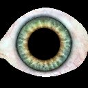 | 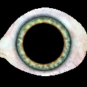 | 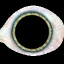 | 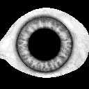 | 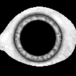 |  |
| **`newt`**<br><sub>Eye of newt (Adafruit)</sub> | 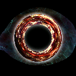 | 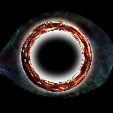 | 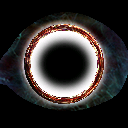 | 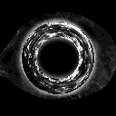 | 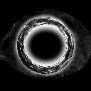 | 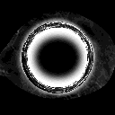 |
| **`anime`**<br><sub>Large violet anime iris</sub> | 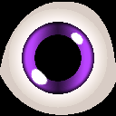 | 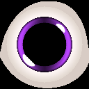 | 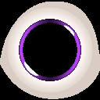 | 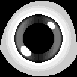 | 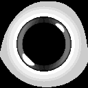 | 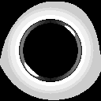 |
| **`bigblue`**<br><sub>Pale blue, heavy limbal ring</sub> | 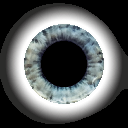 | 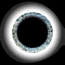 | 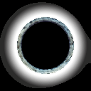 | 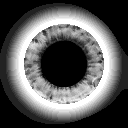 | 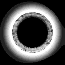 | 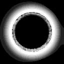 |
| **`blueflame1`**<br><sub>Blue flame ring on black</sub> |  | 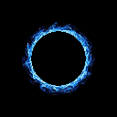 | 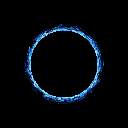 | 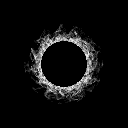 | 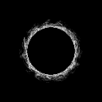 | 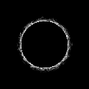 |
| **`blueflame2`**<br><sub>Blue flame, slit pupil</sub> | 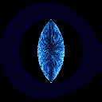 | 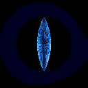 | 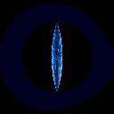 | 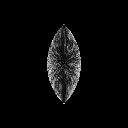 | 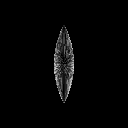 | 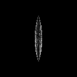 |
| **`brown`**<br><sub>Warm brown, veined sclera</sub> | 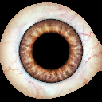 | 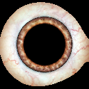 | 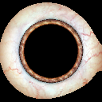 | 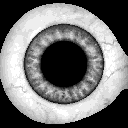 | 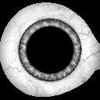 | 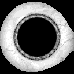 |
| **`cat`**<br><sub>Yellow cat eye, slit pupil</sub> | 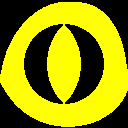 |  |  | 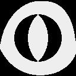 |  |  |
| **`demon`**<br><sub>Red demon, slit pupil</sub> | 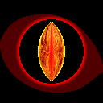 | 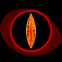 | 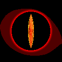 | 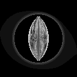 | 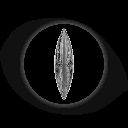 | 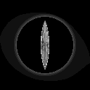 |
| **`doe`**<br><sub>Soft brown doe eye</sub> | 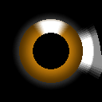 | 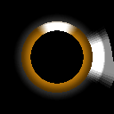 |  |  |  |  |
| **`doomred`**<br><sub>Red on white, cartoon</sub> |  |  |  |  |  |  |
| **`doomspiral`**<br><sub>Red spiral</sub> |  |  |  |  |  |  |
| **`dragon`**<br><sub>Fiery dragon, slit pupil</sub> |  |  |  |  |  |  |
| **`firebox`**<br><sub>Orange fire ring</sub> |  |  |  |  |  |  |
| **`fish`**<br><sub>Pale fish eye, no eyelids</sub> |  |  |  |  |  |  |
| **`fizzgig`**<br><sub>Orange fizzgig</sub> |  |  |  |  |  |  |
| **`flame`**<br><sub>Flame iris, slit pupil</sub> |  |  |  |  |  |  |
| **`hazel`**<br><sub>Hazel, veined sclera</sub> |  |  |  |  |  |  |
| **`hypnored`**<br><sub>Red hypnotic rings</sub> |  |  |  |  |  |  |
| **`leopard`**<br><sub>Golden leopard</sub> |  |  |  |  |  |  |
| **`newt2`**<br><sub>Eye of newt (TeensyEyes)</sub> |  |  |  |  |  |  |
| **`skull`**<br><sub>Red on bone, no eyelids</sub> |  |  |  |  |  |  |
| **`snakegreen`**<br><sub>Green snake, slit pupil</sub> |  |  |  |  |  |  |
| **`spikes`**<br><sub>Geometric spikes</sub> |  |  |  |  |  |  |
| **`toonstripe`**<br><sub>Striped cartoon, no eyelids</sub> |  |  |  |  |  |  |

## Choosing which eyes are built in

**[See the gallery above](#gallery)** for every design rendered in colour
and greyscale.

25 designs ship with the project: two from Adafruit's original Uncanny Eyes,
and 23 converted from [TeensyEyes](https://github.com/chrismiller/TeensyEyes).
Each costs roughly **158 KB of flash**, so about four fit alongside everything
else — they are chosen at build time rather than all
compiled in.

Edit `include/eyes_config.h`:

```c
#define EYE_DEFAULT 1   // Standard human-ish hazel eye
#define EYE_NEWT    1   // Eye of newt
#define EYE_DRAGON  0   // Fiery dragon, slit pupil
...
```

Or override without touching the file, from `platformio.ini`:

```ini
build_flags = -DEYE_DEFAULT=0 -DEYE_NEWT=0 -DEYE_DRAGON=1 -DEYE_SKULL=1
```

Every switch is `#ifndef`-guarded, so a `-D` always wins. Enabling none fails
with a clear `#error` — the eye headers are also where the `SCLERA_*`,
`IRIS_*` and `SCREEN_*` dimensions come from.

The console lists whatever ended up in the build, and selects by name or
number:

```
> eye
  0  default     <- current
  1  dragon
  2  skull
> eye dragon
ok eye=1 dragon
```

### On greyscale panels

Designs that carry their character in *hue* rather than *brightness* flatten
out badly once converted to 16 grey levels. The gallery shows both side by
side — compare before committing. Designs with strong tonal structure, like
`skull`, `demon` and `spikes`, survive the conversion best.

### Adding or regenerating designs

The converted headers are generated, and the generator is checked in:

```sh
git clone --depth 1 https://github.com/chrismiller/TeensyEyes.git
pip install pillow
python tools/gen_eyes.py TeensyEyes/resources/eyes/240x240
```

That writes `include/eyes/*.h` and the gallery images. Then add an `EYE_FOO`
switch to `include/eyes_config.h` and a registry row to `src/main.cpp`.

Dimensions must match what is already built in: **SCLERA 200×200, IRIS_MAP
256×64, SCREEN 128×128, IRIS 80×80**. The renderer reaches the artwork through
pointers whose row width is fixed at compile time, so designs of different
sizes cannot coexist in one build.

Budget against the real figure rather than the ESP32 default: this project
sets `board_build.partitions = min_spiffs.csv` for every environment, giving a
**1.9 MB** app partition. A `gray_rtc` build — network, RTC, authentication,
two designs — uses 1.39 MB of that, about 71%, so roughly three more designs
fit. The 1.25 MB default never applies here, and could not: the firmware is
already larger than it.

## If the panels are wired the wrong way round

`swap` exchanges the chip-select pins in software, so the panel on `D15`
becomes the one on `D4` and vice versa:

```
> swap
ok swap=on
```

This is a real swap, not a relabelling — everything belonging to an eye moves
with it, including its mirrored eyelids and its splash label. Verify with
`splash`, or reboot and read the name cards.

The swap is applied between frames, never mid-transaction, so it cannot leave
a chip select asserted on the wrong panel.

## Pupil

`pupil off` removes the pupil entirely, leaving a full iris disc:

```
> pupil off
ok pupil=off (full iris disc; dilate has no effect)
```

The iris is drawn where `iScale * distance / 128 < 64`, and distance peaks at
127 at the centre, so any scale at or below 64 keeps every pixel in the iris.
There is nothing left to dilate, which is why `dilate` stops having an effect.

Useful on its own, and it pairs with the clock — a full disc makes a better
dial than a ring around a pupil.

## Startup splash

At boot, each panel names itself for five seconds:

```
   FRANK'S
    RIGHT
  ─────────
    YOUR
    LEFT
      5
```

Both perspectives are shown because "left eye" is ambiguous in every wiring
table ever written. This is the quickest way to confirm which panel is on
which chip select without getting at the wires.

## Credits

The two built-in designs, `default` and `newt`, come from Adafruit's
[Uncanny Eyes](https://learn.adafruit.com/animated-electronic-eyes) by
Phil Burgess / Paint Your Dragon.

Every other design is converted from
**[TeensyEyes](https://github.com/chrismiller/TeensyEyes)** by Chris Miller,
MIT licensed, which in turn builds on Adafruit's Uncanny Eyes and M4_Eyes.

TeensyEyes stores its artwork polar-unwrapped and renders it at 240x240 for
round displays. [`tools/gen_eyes.py`](../tools/gen_eyes.py) re-renders it into
this project's format: a Cartesian 200x200 sclera the view pans across, a
256x64 polar iris strip, 128x128 eyelid threshold maps, and a packed
angle/distance table. Eyelid masks are converted to threshold maps, and slit
pupils are reconstructed from the source `slitRadius`.

To regenerate, or to add a design TeensyEyes gains later:

```sh
pip install pillow
python tools/gen_eyes.py            # writes include/eyes/ and docs/images/eyes/
```
