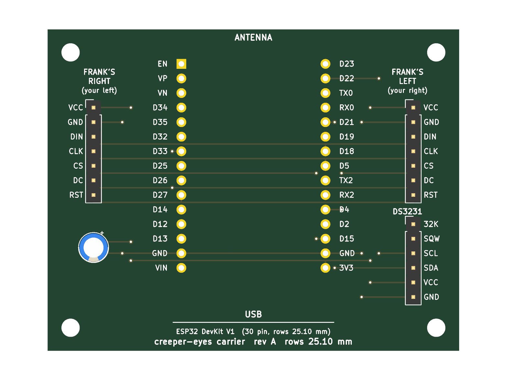

# A circuit board for Frank

The breadboard and its fourteen jumper wires, as a printed circuit board: a
carrier that the ESP32 DevKit plugs into, with a header for each eye and one
for the optional clock, and the SPI bus in copper instead of Dupont leads.

> **This is preliminary work. As of 9/12/2026, this is completely untested.**
> Board delivery and testing expected in a month.
>
> Everything below has been checked by KiCad — electrical rules, schematic
> against board, design rules — and by nothing else. No board has been made,
> no DevKit has been plugged into one, and no eye has blinked on one.



## What it is

There are no discrete electronics in this project. The whole thing is three
off-the-shelf modules and the wires between them:

- an ESP32 DevKit V1 (30-pin, 2.54 mm headers)
- two Waveshare 1.5" OLED panels, which share an identical 7-pin header
- optionally, a DS3231 module

So the board is a **carrier**: a socket for the DevKit, a 7-pin header for
each eye, a 6-pin header for the RTC, and the shared SPI bus routed between
them in copper. One capacitor, because the panels' boost converters draw in
bursts and it costs nothing. No active parts, nothing surface-mount, nothing
to calculate. Its job is to replace the breadboard with something that cannot
come loose inside a sealed head.

The wiring is exactly [WIRING.md](../docs/WIRING.md) and
[WIRING_RTC.md](../docs/WIRING_RTC.md):

| Signal | DevKit pin | Goes to |
| :----- | :--------- | :------ |
| 3V3 | `3V3` | both panels, RTC, C1 |
| GND | `GND` | both panels, RTC, C1 |
| DIN | `D18` | both panels |
| CLK | `D5` | both panels |
| DC | `D33` | both panels |
| RST | `D27` | both panels |
| CS | `D15` | Frank's right panel (J3, your left) |
| CS | `D4` | Frank's left panel (J4, your right) |
| SDA | `D21` | RTC |
| SCL | `D22` | RTC |

72 × 56 mm, two layers, four M3 mounting holes. The DevKit plugs in with its
USB connector towards the bottom edge and its antenna end flush with the top
edge — the antenna section overhangs by about half a millimetre, and there
is no copper anywhere near it in any case. Every socket pin is labelled with the
DevKit's own name for it, and each eye connector says whose eye it is in
both senses, so a board sitting on the bench answers the question the wiring
guide spends a page on.

The panels connect by cable — a 7-wire Dupont lead or a JST-XH pigtail onto
each header — because they live in the head's eye sockets, not on the board.
The RTC header follows the pin order of the common ZS-042 module (`32K SQW SCL
SDA VCC GND`), so that one plugs straight in; any other module goes on by four
wires to the labelled pins.

## What it costs

| | Five boards | Per board |
| :-- | :-- | :-- |
| JLCPCB or PCBWay, 2-layer, 72 × 56 mm | ~$2 fabrication, $2–5 slow shipping (~$20 by courier if impatient) | under $2 |
| Two 1×15 female headers, 2.54 mm — the DevKit socket | ~$1 | |
| Two 1×7 and one 1×6 male pin headers, 2.54 mm | ~$1 | |
| C1, 10 µF electrolytic, 5 mm diameter, 2 mm lead pitch (any value 10–100 µF fits) | pennies | |

**About $10 for five boards, all in**, and one to two weeks. The DevKit and
the displays you already own plug into it.

The other tier — an integrated board with the ESP32-WROOM module soldered
down, USB-C, a CH340 and a regulator, assembled at the fab — comes to $8–15 a
board in small quantities plus setup fees, and buys nothing over the $5 DevKit
except a slimmer profile and the loss of "unplug it and swap it". Not worth
it. This is a carrier board.

## Two boards, because there are two DevKits

Along each row the pins are on 2.54 mm centres on every board — that is the
header strip itself, and nobody gets it wrong. The distance *between* the two
rows is the clone maker's own choice, and it varies. So the design is one and
the boards are two, in directories named for the number:

| Directory | Row pitch | For |
| :-- | :-- | :-- |
| `rows-25.10mm/` | 25.10 mm | The author's DevKit, a 30-pin "DevKit V1" clone, measured |
| `rows-25.4mm/` | 25.4 mm (1.0") | The DOIT reference design and clones that follow it |

Each holds its own KiCad project, a `gerbers/creeper-eyes-rows-…-gerbers.zip`
to upload, and renders. The pitch is printed on both sides of the board, so
five of each can sit in a drawer without confusion.

## Before ordering: two things to check against your DevKit

Both are things a datasheet cannot settle, because "ESP32 DevKit V1" is a
name a dozen factories use.

1. **The row pitch.** Measure across both rows of pins with calipers, at
   the base of the pins where they enter the plastic rather than at the
   tips, which are often toed in. Take the outside-to-outside and the
   inside-to-inside readings: their average is the centre-to-centre pitch,
   and their difference should be one pin width (~0.64 mm), which tells you
   the measurement is sound. The author's board read 25.72 and 24.48, so
   25.10. Order the variant that matches; if neither does, add a line to
   `VARIANTS` in `gen_board.py` and regenerate (below). Half the board moves
   with it; nothing needs redrawing.
2. **The pinout.** Hold the DevKit with the USB connector towards you,
   components up. The left row should read `EN VP VN D34 D35 D32 D33 D25 D26
   D27 D14 D12 D13 GND VIN` top to bottom, and the right row `D23 D22 TX0 RX0
   D21 D19 D18 D5 TX2 RX2 D4 D2 D15 GND 3V3`. That is what the board's
   silkscreen says beside each socket pin, so a mismatch is a matter of
   holding the two next to each other. If a pin differs, `DEVKIT_LEFT` and
   `DEVKIT_RIGHT` in `gen_board.py` are where to say so.

Then two things worth knowing that are not risks: the pads are square for
pin 1 of every connector, and C1's footprint carries a `+` mark on the
silkscreen — the longer lead of the capacitor goes there.

## Ordering

Upload the zip from the matching variant's `gerbers/` directory to
[JLCPCB](https://jlcpcb.com) or [PCBWay](https://www.pcbway.com). The defaults are right: 2 layers, 1.6 mm,
HASL, any colour, quantity 5. Nothing on the board comes near a design rule —
the narrowest anything gets is 0.25 mm tracks and about 0.3 mm of clearance,
against minimums of 0.127.

Solder the two 15-pin sockets first, using the DevKit itself as a jig to keep
them parallel: plug the sockets onto the DevKit, drop the assembly into the
board, solder, unplug. Then the pin headers, then C1.

## How it was made, and how to change it

The board is generated by a script rather than drawn, because the one
dimension that has to be measured moves half the layout:

```sh
"%LOCALAPPDATA%/Programs/KiCad/10.0/bin/python.exe" hardware/gen_board.py     # writes every variant
"%LOCALAPPDATA%/Programs/KiCad/10.0/bin/python.exe" hardware/make_outputs.py  # checks and exports each
```

Either takes a pitch as an argument to do just one: `gen_board.py 25.4`.

Both need [KiCad](https://www.kicad.org/) 9 or later, and run with the
Python inside it — the layout is built through KiCad's own `pcbnew` module.
`gen_board.py` holds the netlist as one table and the routing as a list of
coordinates on a 2.54 mm grid, with everything right of the DevKit's left row
placed relative to the pitch; `make_outputs.py` runs the electrical rule
check, compares the schematic's netlist with the board's pad by pad, runs the
design rule check with schematic parity, and only then exports the Gerbers
and the renders. All four pass clean for both variants at the moment.

Editing in KiCad directly also works — it is an ordinary project — but a
regeneration will overwrite it, so a change worth keeping belongs in the
script.

The DevKit's footprint and the three symbols with meaningful pin names live in
each variant's `.pretty/` directory and `.kicad_sym` file, which its library
tables point at.

## Not on the board

Kept off deliberately, and cheap to add if there is ever a reason:

- a header breaking out the unused pins (`D19`, `D23`, `D25`, `D26`, `D32`,
  `D34`, `D35`, …) for sensors
- a photocell, which upstream Uncanny Eyes uses to drive dilation
- a ground pour — at 8 MHz on a 7 cm board, with the breadboard already
  working, it would be decoration

## Files

| | |
| :-- | :-- |
| `gen_board.py` | The design, as a script. Edit this. |
| `make_outputs.py` | Checks, Gerbers, renders |
| `rows-25.10mm/`, `rows-25.4mm/` | One directory per DevKit row pitch, each containing: |
| `  creeper-eyes-rows-…mm.kicad_pro` / `.kicad_sch` / `.kicad_pcb` | The KiCad project the script writes |
| `  creeper-eyes-rows-…mm.pretty/`, `.kicad_sym` | Project footprint and symbol libraries |
| `  gerbers/creeper-eyes-rows-…mm-gerbers.zip` | What the fab wants |
| `  images/` | Renders of both sides, and the schematic as a PDF |
